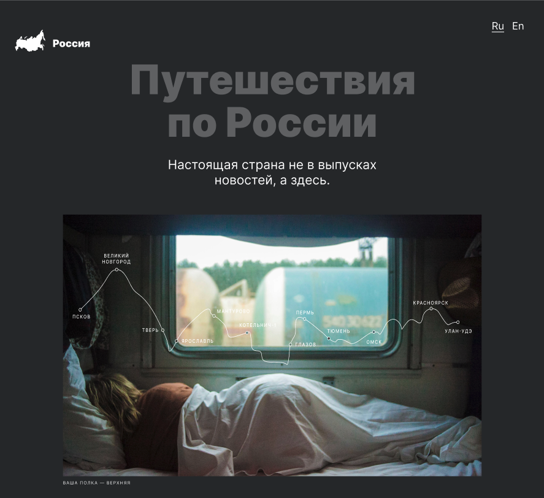
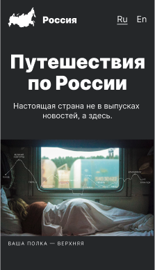

# "Путешествия по России"

## Описание проекта
Проект представляет собой адаптивный одностраничный сайт. В нем рассказывается о самых интересных местах для путешествия по России.

## Desktop and mobile
| Десктопная версия сайта | Мобильная версия сайта |
|-------------|-------------|
|||

## Инструменты и технологии
* семантические теги HTML5,
* flexbox,
* grid,
* адаптивная верстка через media-queries,
* относительные размеры блоков/элементов,
* позиционирование,
* псведоэлементы и псевдоклассы,
* БЭМ (наименование классов и организация файловой структуры Nested),
* подключены шрифты и их сглаживание,
* сайт сверстан по макету из Figma.

-----------

* [Ссылка на макет в Figma](https://www.figma.com/file/BCeFNwsVdQUpqMfWJEGlw7/Sprint-3_-Russia-_-desktop-%2B-mobile-(Copy)?type=design&node-id=28503%3A0&mode=design&t=U3Rf4BE0mwJs8iMr-1)

